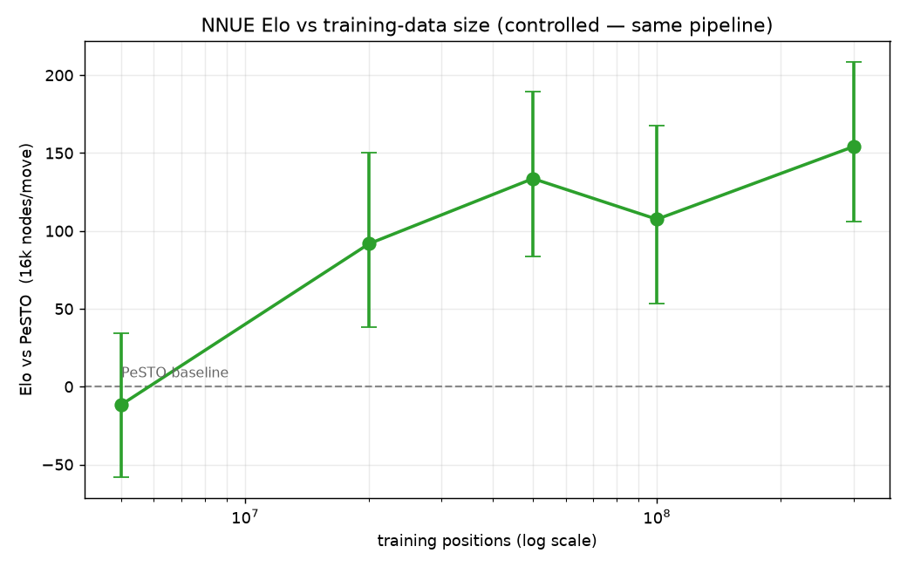

# brandobot — a chess engine

> A UCI chess engine with a native Rust core and a learned NNUE evaluation that
> outplays its hand-tuned baseline by ~115 Elo.

[](https://github.com/bmransom/chess-ai/actions/workflows/check-fast.yml)
[](#license)

brandobot pairs a native **Rust core** (`brandobot_core`, a PyO3 module) that owns
all chess logic with two thin Python wrappers: a UCI engine over stdin/stdout and a
Flask HTTP API.

## Play it

Challenge it on lichess: https://lichess.org/@/brandobot. Classical time controls
are preferred.

## What's inside

The Rust core (`core/`) implements:

- **Bitboard move generation** with a perft suite for validation
- **Evaluation** — a tapered PeSTO baseline (material, piece-square tables, mobility,
  king safety, pawn structure) *plus* an optional **NNUE** network that beats it by
  ~115 Elo: a `768→256` perspective net, integer-quantized, updated incrementally on
  make/unmake
- **Iterative-deepening negamax** with alpha-beta pruning and quiescence search
- **Move ordering** — MVV-LVA plus killer-move and history heuristics
- A **transposition table** and **time management**

Two production entrypoints wrap the core:

- **UCI engine** — `src/main.py` (`--net nets/net.nnue` enables the NNUE eval),
  bridged to lichess via [lichess-bot](https://github.com/lichess-bot-devs/lichess-bot)
- **HTTP API** — `src/api.py` (Flask): `POST /next_move {fen}` → `{move}`,
  `GET /transposition_table`, `GET /decision_tree`

## Strength

The optional **NNUE** evaluation — trained by knowledge distillation on 100M
Stockfish-scored Lichess positions — beats the hand-tuned PeSTO eval by
**+115 Elo [+91, +141]** in a fair-match, node-limited SPRT, at ~0.4% speed cost
(the accumulator updates incrementally instead of recomputing). Against
strength-limited Stockfish it plays around **2400** in blitz.

Strength rises steeply with training data, then plateaus past ~50M positions:



Reproduce it: `scripts/fetch_lichess_evals.py` → `scripts/build_dataset.py` →
`scripts/train.py`, then `scripts/sprt.py` for the fair-match verdict. The shipped
net (`nets/net.nnue`) is committed; the training data is regenerated from the scripts.

## Run it locally

A one-time setup needs a [Rust toolchain](https://rustup.rs):

```bash
python3 -m venv .venv && .venv/bin/pip install -r requirements-dev.txt
.venv/bin/maturin develop --release -m core/Cargo.toml   # build the Rust core into the venv
```

Then:

```bash
.venv/bin/python src/main.py                       # UCI engine, PeSTO eval (type: uci, isready, go, quit)
.venv/bin/python src/main.py --net nets/net.nnue   # UCI engine with the stronger NNUE eval
.venv/bin/python src/api.py                         # Flask HTTP API
.venv/bin/python src/perft.py                       # move-generation benchmark
scripts/check-fast.sh                               # the gate: fmt/clippy/test + maturin + ruff + pytest + knowledge
```

See [`AGENTS.md`](AGENTS.md) for the full command list and contributor workflow.

## Deploy to lichess

[lichess-bot](https://github.com/lichess-bot-devs/lichess-bot) bridges the engine
to lichess: clone it as a sibling repo, build the native core (above), and point
its engine configuration at the UCI entrypoint (`python src/main.py --net nets/net.nnue`).
For a standalone binary, package the entrypoint with `pyinstaller src/main.py`.

## Debugging the search

The HTTP API exposes the engine's reasoning: `GET /decision_tree` returns the
captured search tree for the last position, and `GET /transposition_table` dumps
the cache. The Rust core records the tree to a configurable depth.

## Roadmap

Tracked work lives on the board in [`roadmap/ROADMAP.md`](roadmap/ROADMAP.md);
ideas not yet committed sit in [`roadmap/BACKLOG.md`](roadmap/BACKLOG.md). The
vocabulary contract is [`knowledge/glossary.md`](knowledge/glossary.md).

## License

Released under the **MIT License** (declared in `core/Cargo.toml`).
