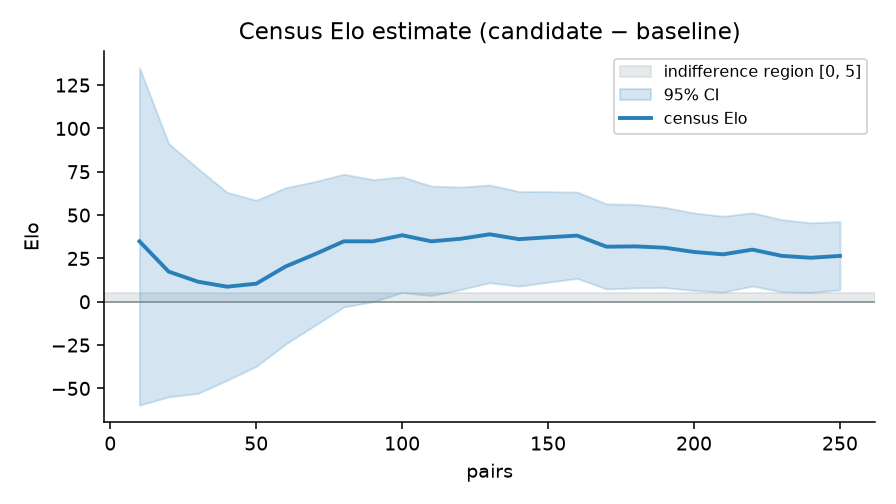
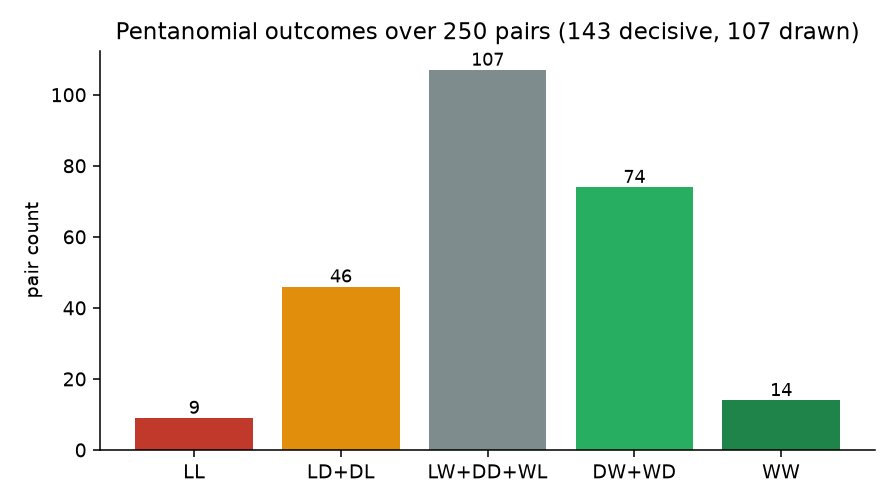
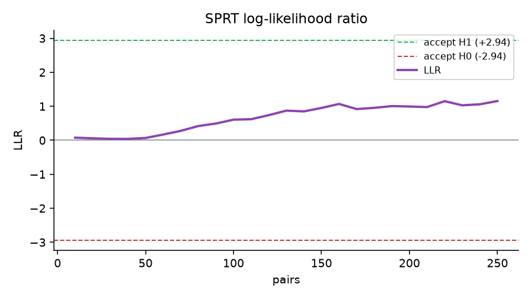
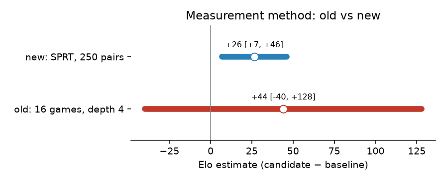

# Evaluation — fair-match measurement

## Summary

Measured with the fair-match SPRT, the full positional evaluation
(PeSTO + king safety + mobility + pawn structure) is **+26.5 Elo
`[+6.9, +46.2]` (95%)** stronger than plain PeSTO. The confidence interval
**excludes zero**, so the positional terms collectively help; the formal SPRT
verdict is `inconclusive` only because the effect sits just above the strict
`H1 = 5` bound and 250 pairs is short of a crossing. **Recommendation: keep the
positional evaluation.**

## Why re-measure

The Epic 4 terms were originally decided with `selfplay.py --games 16 --depth 4`.
Every result carried a `±60–84` Elo margin — wide enough to span both a +30 and a
−30 term — so mobility and pawn structure were *dropped* and king safety *kept* on
numbers that were statistically indistinguishable from each other and from zero.
The [fair-match harness](../fair-match-harness/design.md) exists to replace that
guesswork; this is its first use.

## Method

| Knob | Value |
|---|---|
| Test | Pentanomial SPRT, H0 Elo ≤ 0 vs H1 Elo ≥ 5, α = β = 0.05 |
| Play | Fixed **12,000 nodes/move** (deterministic, equal effort) |
| Book | UHO_4060_v4 — unbalanced human openings, 241,670 positions (CC0) |
| Candidate | `feat/eval-positional-terms` (PeSTO + KS + mobility + pawn) |
| Baseline | `eval-no-king-safety` (PeSTO material + placement only) |
| Cap | 250 unique color-swapped pairs |

The **cumulative** comparison (all terms vs none) is deliberate: each individual
term is so small that king-safety-on vs king-safety-off draws nearly every game,
so isolating one term would need tens of thousands of pairs (days of compute).
The whole positional bundle is a large enough signal to measure in a feasible run.

## Result

`inconclusive` after 250 pairs · LLR `+1.15` · counts `[9, 46, 107, 74, 14]` ·
**Elo `+26.5 [+6.9, +46.2]`** · 143/250 pairs decisive (57%).

### Census Elo converges, and clears zero



The estimate settles near +27 Elo; the 95% interval narrows from ±90 to ±20 and
its lower bound rises above the indifference region by ~100 pairs.

### The outcomes are decisive enough to measure



Unlike king-safety-in-isolation (which drew out), the cumulative gap produces a
healthy decisive rate — the SPRT and census have real signal to work with.

### The likelihood ratio rises but does not cross



LLR climbs steadily toward the `accept-H1` bound without reaching `+2.94` inside
250 pairs — exactly what a real-but-modest effect (just above +5 Elo) looks like
under strict bounds. A crossing would need several thousand more pairs.

### Old method vs new



The old 16-game method's margins (`±60–84`) spanned zero on every term; the SPRT
census excludes it. (Not a strict A/B — the two methods used different baselines —
so read this as a precision contrast, not an identical comparison.)

## Decision

- **Keep the positional evaluation** (king safety, mobility, pawn structure). The
  bundle is confidently positive, and each term is a textbook CPW signal with a
  passing per-term unit test and the symmetry invariants intact.
- **Per-term retention stays unverified.** The cumulative result does not prove
  each term helps individually; isolating king safety, mobility, or pawn structure
  at strict bounds is impractical at this engine's speed. If a term ever needs
  dropping, that calls for a dedicated long run (or a faster engine binary).
- **Cost gate not yet run.** The terms are bitboard-based and cheap, but a
  `--cost-check` node-rate pass should accompany a final keep before lichess play.

## Reproduce

```bash
.venv/bin/python scripts/fetch_uho.py
scripts/measure_terms.sh feat/eval-positional-terms eval-no-king-safety \
  --nodes 12000 --max-pairs 250 --max-moves 90 --progress-every 10
scripts/plot_measurement.py <log> roadmap/specs/evaluation/assets
```

Raw log: [`assets/cumulative-sprt.log`](assets/cumulative-sprt.log).
